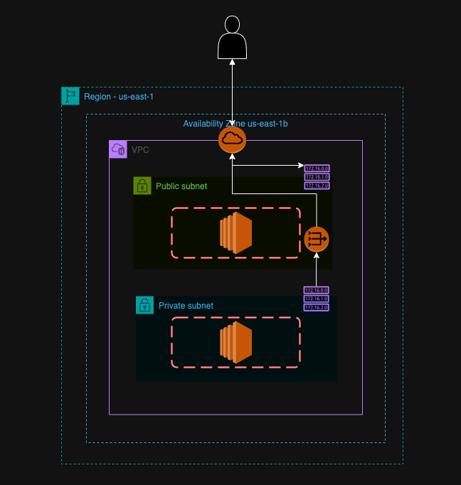
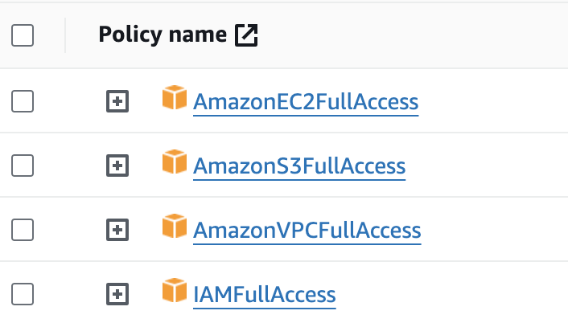

## AWS infrastuckture provisioning with Terrform

This is a sample project to get started with AWS infra provisioning using terraform.

### Architecture Diagram

### Prerequisites
- AWS CLI
  ```
  brew install awscli
  ```
- Terraform CLI
  ```
  brew install terraform
  ```
- TFSEC
    ```
    brew install tfsec
    ```

#### AWS IAM User
Create a separate IAM user with following permissions. DO NOT use the root user for this. 

#### Configure AWS Credentials
Use the access key and secret from the newly created IAM user to configure aws cli.
```
aws configure
```

#### AWS Private Key

Create if you dont have one already. This is the private key and keep it safe.

```
aws ec2 create-key-pair \
    --key-name my-key-pair \
    --key-type rsa \
    --key-format pem \
    --query "KeyMaterial" \
    --output text > my-key-pair.pem</code>

chmod 400 my-key-pair.pem
```

#### Create TF Alias

```
alias tf=terraform
```

### Working with Terraform

Intialize terraform. This will initialize terraform provider defined in the configuration file.

```
tf init
```
Perform static analysis of tf script. This will highlight potential misconfigurations and security risks. 
```
tfsec .
```

Use below commands to provision and destroy the AWS infra. 

```
tf validate
tf plan
tf apply
tf destroy
```

#### EC2 in Public Subnet

Upload your pvt key from the local machine. Make sure to change the public IP.

```
sudo scp -i  ./my-key-pair.pem  ./my-key-pair.pem ec2-user@<public ip>:/home/ec2-user

ssh -i "my-key-pair.pem" ec2-user@<public ip>
```

Validate outbound call

```
sudo yum update -y
```

#### Connect to EC2 in Private Subnet

From the public EC2 fire the following command. Make sure to change the private EC2 IP.

```
ssh -i "my-key-pair.pem" ec2-user@<private ip>
```

Validate outbound call

```
sudo yum update -y
```
